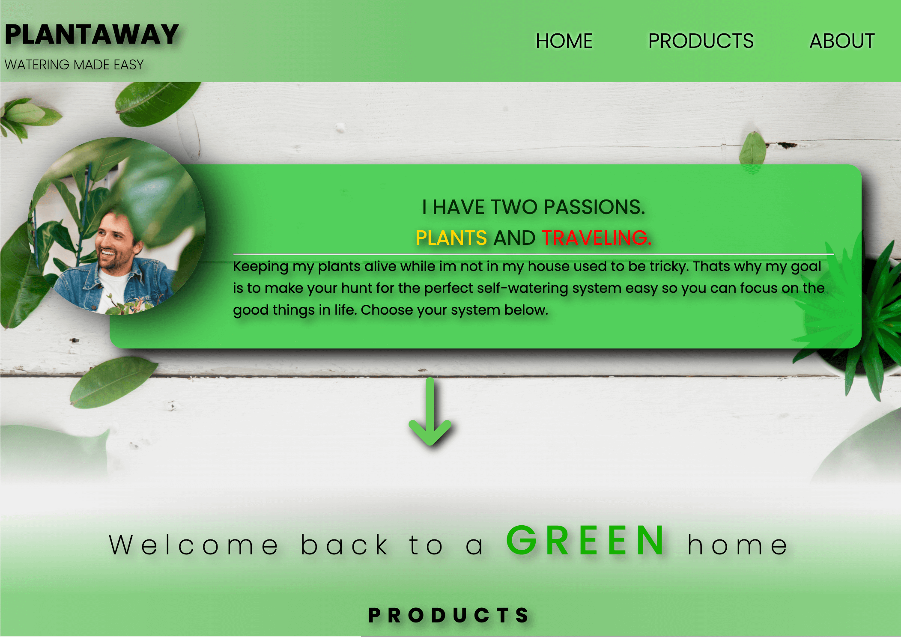
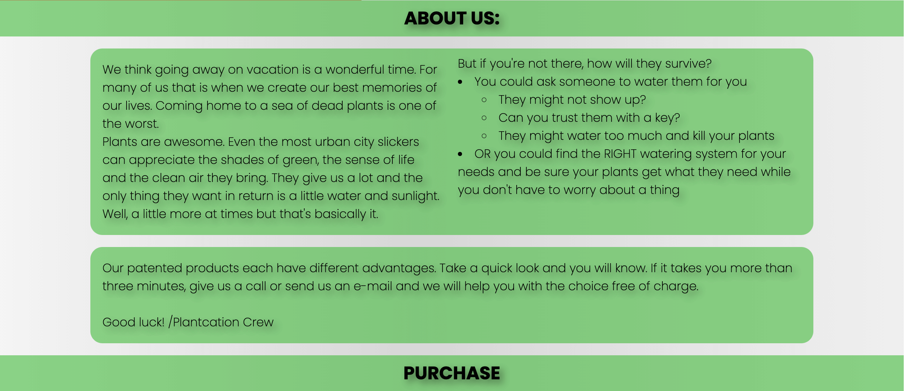

# Plantaway

[Link to live site](https://catbackmancasino.github.io/MS1-ericbackman-plantcation/)

Even the most urban city slicker of the concrete djungle can appreciate the fresh air and the different shades of green that houseplants provide, but we don't always have the time to tend for them. We travel for work, for vacation, to friends and family and some of us live hectic lives and simply forget them.

We can not help with your planning but we can provide simple ways to keep your plants alive. 

This site will make sure you always return to a green home while you're off living life to it's fullest.

## User Stories

- First time visitors:
    - As a first time visitor I find the site via google searching for a way to solve a problem.
    - When i reach the site I want to quickly find adequate information about the products.
    - The information and illustrations need to convince me that
        - The site is reliable.
        - The products are functional
    - As a first time visitor i need the process of purchase is made easy.

- Returning visitors:
    -   As a returning visitor I visit the site mainly to purchase a product I already know exist.
    - I want to know if there are any new products without making my goal of purchase any less easy.
    - I want to quickly find the purchase form and fill in my information

## Features 

I wanted to create a very simple visual language that corresponds with the companys brand. A simple and effective language with a positive vibe that gives no place for unnecessary features. Each feature is there for a reason.

### Intro Animation

I wanted the first impression to be simple but also fun. The intro does just that. It's unexpected and shows a childish and almost retro feeling while also hinting to the travel aspect of the business idea by greeting the customer in four different languages.

- Navigation Bar

 The site has a navigation bar fixed to the top of the view window to make it easy for the potential shopper to navigate through the different sections.
 By clicking any of the links the user will be transported to the corresponding area of the site. 
 Depending on screen size there will be either a hamburger dropdown or a regular header.

- __The landing page image__

The first thing to catch your eye is a picture of our founder and a quote that makes the visitor feel the company is trustworthy. There are millions of sites out there so creating a personal connection with the customer makes all the difference. This get's us one step closer. By ending the section with a positive quote we send the visitor to the next section with a positive feeling.

## Quote/Showcase
This section is used to either showcase a new product or any other news regarding the company and its products. If there are nothing new to tell there will be a positive quote.

- __Products Section__

Plantaway has three products with different features. The clients are everything from plant experts who already know what they want to persons who found the site because they have no idea how to solve the issue with watering while they're occupied with other things. The product section must tend to both.

For the more experienced plantista we have a large button with a cart to indicate purchase and a price. Click it and they will arrive at the purchase form. simple and straight.

For the newcomers of the indoor farmer life, I made extremely simple illustrations and awell formulated sales pitches to explain each products advantages before gently pushing them towards the purchase form.

- __About us section__

 This section gives the client an insight as to why Plantaway was founded. They are introduced to the common issues with keeping their plants alive  while not being available and what options they have to solve the problem.

 The user will be prompted to use our help to find the right product (if needed) or order from the purchase form.

- __The Purchase Form__

  - This is where the customer can order each product. The form is briliantly put togeather ensuring all the correct info is aquired. all fields except from the last to product rows are required. This is because if the cliebnt only want to order lets say one pSphear they wont have to fill out the fields for those who wants to order one of each or ten of each. There is also a terms and conditions page linked but it contains nothing more than a short text and an animated hammer.

- __The Footer__ 

 The footer is very simple and effective giving the visitor links to our social media profiles as well as opening hours and business location.

 

All parts of this page is included in the index.html file and /assets/css/style.css files as well as the 404.html abnd terms.html.

- 404 error page
Any site is nothing without a decent 404 document. 

- __Terms__

In the purchase form you will find a link to the terms and conditions.
No terms have been added but a proper text could be copy pasted in there.

###Future Features Left to Implement

Obviously a proper purchase feature linked to creditcards and other payment services would be wise to implement to make purchases even more simple.

Getting a propper illustrator to make more visually appealing desribing the products would make the site look better and create a more professional impression.

A customer review section would make a first time customer feel more confident about a purchase.

## Testing 

In this section, you need to convince the assessor that you have conducted enough testing to legitimately believe that the site works well. Essentially, in this part you will want to go over all of your project’s features and ensure that they all work as intended, with the project providing an easy and straightforward way for the users to achieve their goals.

In addition, you should mention in this section how your project looks and works on different browsers and screen sizes.

You should also mention in this section any interesting bugs or problems you discovered during your testing, even if you haven't addressed them yet.

If this section grows too long, you may want to split it off into a separate file and link to it from here.

The testing has mainly concisted in testing it on all my own devices and also with google dev-tools.

Testing has concisted of mainly me doing my best to find any issues with responsivenes and funtcionality by testing the live site on my Macbook 15" late 2018 model and my iphone 12. 

I used googels dev-tools to virtually try it on different devices. After not finding any bugs or issues i asked my family to test it on their devices to see if they understand the site and if it works the way it should.
This resulted in two issues/bugs.
 - The word "home" in the  "quote" section appeared on top of the product section on smaller screens
 - After pressing "go" in the form a site opens to confirm the visitor is human. This opened in the same window and since the link back to the main site did not work it could cause problems.

 Both issues have been adresses and are solved.

### Tested Devices
 - Iphone 12 
    - chrome - No issues
    - Safari - No issues
    - DuckDuckGo -No issues
    
 - iphone 12 mini
    - safari  - no issues

- lenovo 15" 
    - issue with "home in the quote section dropping to a new line on top of products. 
        - Issue is fixed.

 - iphone 11 chrome 
    - no issues

### Validator Testing 

- HTML
  - No errors were returned when passing through the official [W3C validator](https://validator.w3.org/nu/?doc=https%3A%2F%2Fcatbackmancasino.github.io%2FMS1-ericbackman-plantcation%2Findex.html)
- CSS
  - No errors were found when passing through the official [(Jigsaw) validator](http://jigsaw.w3.org/css-validator/validator?uri=https%3A%2F%2Fcatbackmancasino.github.io%2FMS1-ericbackman-plantcation%2Findex.html&profile=css3svg&usermedium=all&warning=1&vextwarning=
)

### Unfixed Bugs

There are no known bugs.

## Deployment

The project was based on the Code Institute GitHub template and deployed via GitHub pages in march 2022.
After creating any repository on GitHub you can follow these steps to deply a site.

1.  Log in to your Github Account
2.  Open the repository that you want to go live with
3.  Go to "settings"
4.  Find the "pages link" on the left side menu.
5.  Under "sources" press the button that says "none" and choose "main"
6.  Click "save" and you will recieve a message saying your site is ready to be deployed.
7.  After a few minutes this message will change into "your site is published at 'link to site'.
8. you are now live and anyone with the link can see your site

## Credits 

All HTML and CSS code is custom made with inspiration from the love running repo. 

 - Positioning assistance - Web Dev Simplified youtube channel
 - Visual and functionality assistance - Brian Macharia
 - Gardient code - https://cssgradient.io/
 - Picture of "owner" - Picture taken from vogue who borrowed it from chronicle books ‘boys with plants’.
 - Fonts by Google Fonts
 - Symbols by Font Awesome
 - Form submit data - FormSubmit.co
 - Inspiration for readme.md - Elaine Broche ![README.md]url(https://github.com/elainebroche-dev/ms1-thrive/blob/master/README.md)

### Content 

All content written by me (Eric Bäckman) pretending to be the founder of the business.

### Media

All visuals except from banner background and owner image is custom made by Eric

Written by Eric Bäckman
March 2022