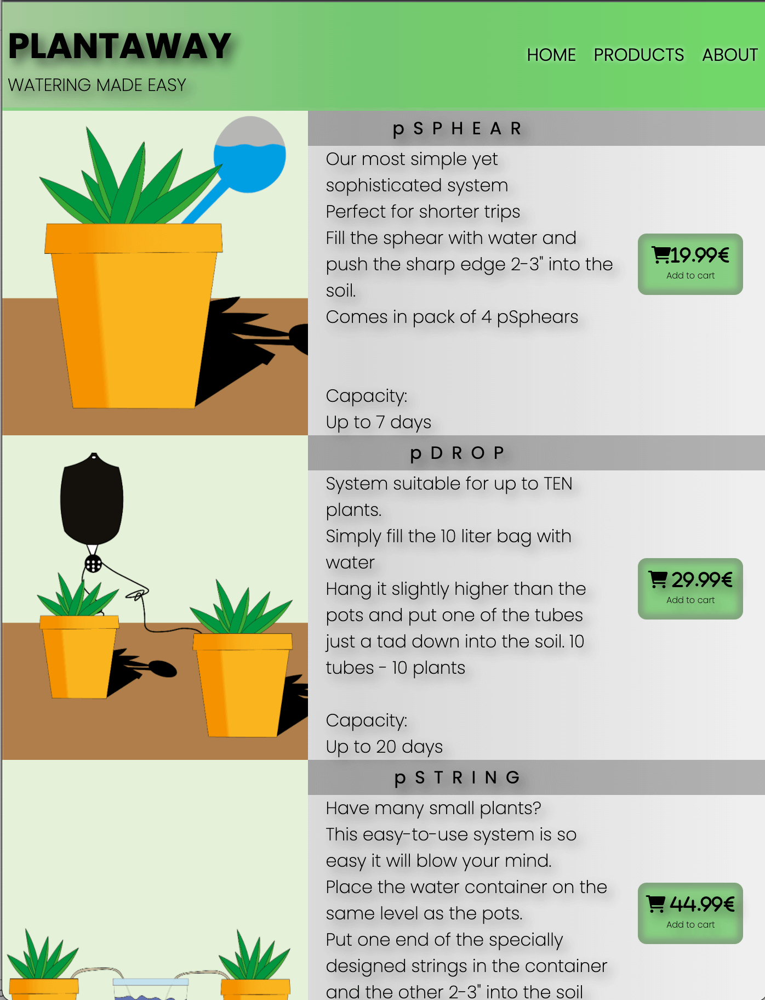

# Plantaway

Even the most urban city slicker of the concrete djungle can appreciate the fresh air and the different shades of green that houseplants provide, but we don't always have the time to tend for them. We travel for work, for vacation, to friends and family and some of us live hectic lives and simply forget them.

We can not help with your planning but we can provide simple ways to keep your plants alive. 

This site will make sure you always return to a green home while you're off living life to it's fullest.

## Features 

I wanted to create a very simple visual language that corresponds with the companys atmosphear. A simple and effective language with a positive vibe that gives no place for unnecessary features. Each feature is there for a reason.

### Intro Animation

I wanted the first impression to be simple but also fun. The intro does just that. It's unexpected and shows a childish and almost retro feeling while also hinting to the travel aspect of the business idea by greeting the customer in four different languages.

- Navigation Bar

 The site has a navigation bar fixed to the top of the view window to make it easy for the potential shopper to navigate through the different sections.
 By clicking any of the links the user will be transported to the corresponding area of the site. 
 Depending on screen size there will be either a hamburger dropdown or a regular header.

- __The landing page image__

The first thing to catch your eye is a picture of our founder and a quote that makes the visitor feel the company is trustworthy. There are millions of sites out there so creating a personal connection with the customer makes all the difference. This get's us one step closer. By ending the section with a positive quote we send the visitor to the next section with a positive feeling.

- __Products Section__

Plantaway has three products with different features. The clients are everything from plant experts who already know what they want to persons who found the site because they have no idea how to solve the issue with watering while they're occupied with other things. The product section must tend to both.

For the more experienced plantista we have a large button with a cart to indicate purchase and a price. Click it and they will arrive at the purchase form. simple and straight.

For the newcomers of the indoor farmer life, I made extremely simple illustrations and awell formulated sales pitches to explain each products advantages before gently pushing them towards the purchase form.

- __About us section__

 This section gives the client an insight as to why Plantaway was founded. They are introduced to the common issues with keeping their plants alive  while not being available and what options they have to solve the problem.

 The user will be prompted to use our help to find the right product (if needed) or order from the purchase form.

- __The Footer__ 

  - The footer section includes links to the relevant social media sites for Love Running. The links will open to a new tab to allow easy navigation for the user. 
  - The footer is valuable to the user as it encourages them to keep connected via social media

- __The Purchase Form__

  - This is where the customer can order each product. The form is briliantly put togeather ensuring all the correct info is aquired. all fields except from the last to product rows are required. This is because if the cliebnt only want to order lets say one pSphear they wont have to fill out the fields for those who wants to order one of each or ten of each. There is also a terms and conditions page linked but it contains nothing more than a short text and an animated hammer.

All parts of this page is included in the index.html file and /assets/css/style.css files. 

- 404 error page
Any site is nothing without a decent 404 document. 

###Future Features Left to Implement

Obviously a proper purchase feature linked to creditcards and other payment services would be wise to implement to make purchases even more simple.

Getting a propper illustrator to make more visually appealing desribing the products would make the site look better and create a more professional impression.

A customer review section would make a first time customer feel more confident about a purchase.

## Testing 

In this section, you need to convince the assessor that you have conducted enough testing to legitimately believe that the site works well. Essentially, in this part you will want to go over all of your project’s features and ensure that they all work as intended, with the project providing an easy and straightforward way for the users to achieve their goals.

In addition, you should mention in this section how your project looks and works on different browsers and screen sizes.

You should also mention in this section any interesting bugs or problems you discovered during your testing, even if you haven't addressed them yet.

If this section grows too long, you may want to split it off into a separate file and link to it from here.

The testing has mainly concisted in testing it on all my own devices and also with google dev-tools.

Testing has concisted of mainly me doing my best to find any issues with responsivenes and funtcionality by testing the live site on my Macbook 15" late 2018 model and my iphone 12. I used googels dev-tools to virtually try it on different devices. After not finding any bugs or issues i asked my family to test it on their devices to see if they understand the site and if it works the way it should.

In testing the link leading back to the mainsite from the form submission site did not properly link back to main site so i made that open in a new tab instead.

### Tested Devices
 - Iphone 12 
    - chrome - No issues
    - Safari - No issues
    - DuckDuckGo -No issues
    
 - iphone 12 mini
    - safari  - no issues

- lenovo 15" 
    - issue with "home in the quote section dropping to a new line on top of products. 
        - Issue is fixed.

 - iphone 11 chrome 
    - no issues

### Validator Testing 

- HTML
  - No errors were returned when passing through the official [W3C validator](https://validator.w3.org/nu/?doc=https%3A%2F%2Fcode-institute-org.github.io%2Flove-running-2.0%2Findex.html)
- CSS
  - No errors were found when passing through the official [(Jigsaw) validator](https://jigsaw.w3.org/css-validator/validator?uri=https%3A%2F%2Fvalidator.w3.org%2Fnu%2F%3Fdoc%3Dhttps%253A%252F%252Fcode-institute-org.github.io%252Flove-running-2.0%252Findex.html&profile=css3svg&usermedium=all&warning=1&vextwarning=&lang=en#css)

### Unfixed Bugs

There are no known bugs.

## Deployment

This section should describe the process you went through to deploy the project to a hosting platform (e.g. GitHub) 

- The site was deployed to GitHub pages. The steps to deploy are as follows: 
  - In the GitHub repository, navigate to the Settings tab 
  - From the source section drop-down menu, select the Master Branch
  - Once the master branch has been selected, the page will be automatically refreshed with a detailed ribbon display to indicate the successful deployment. 

The live link can be found here - https://catbackmancasino.github.io/MS1-ericbackman-plantcation/

## Credits 

All HTML and CSS code is custom made with inspiration from the love running repo. 

Positioning assistance - Web Dev Simplified youtube channel
Visual and functionality assistance - Brian Macharia
Gardient code - https://cssgradient.io/
Picture of "owner" - Picture taken from vogue who borrowed it from chronicle books ‘boys with plants’.

### Content 

- The text for the Home page was taken from Wikipedia Article A
- Instructions on how to implement form validation on the Sign Up page was taken from [Specific YouTube Tutorial](https://www.youtube.com/)
- The icons in the footer were taken from [Font Awesome](https://fontawesome.com/)

### Media

All visuals except from banner background and owner image is custom made by myself. 

## Other General Project Advice

Below you will find a couple of extra tips that may be helpful when completing your project. Remember that each of these projects will become part of your final portfolio so it’s important to allow enough time to showcase your best work! 

- One of the most basic elements of keeping a healthy commit history is with the commit message. When getting started with your project, read through [this article](https://chris.beams.io/posts/git-commit/) by Chris Beams on How to Write  a Git Commit Message 
  - Make sure to keep the messages in the imperative mood 

- When naming the files in your project directory, make sure to consider meaningful naming of files, point to specific names and sections of content.
  - For example, instead of naming an image used ‘image1.png’ consider naming it ‘landing_page_img.png’. This will ensure that there are clear file paths kept. 

- Do some extra research on good and bad coding practices, there are a handful of useful articles to read, consider reviewing the following list when getting started:
  - [Writing Your Best Code](https://learn.shayhowe.com/html-css/writing-your-best-code/)
  - [HTML & CSS Coding Best Practices](https://medium.com/@inceptiondj.info/html-css-coding-best-practice-fadb9870a00f)
  - [Google HTML/CSS Style Guide](https://google.github.io/styleguide/htmlcssguide.html#General)

Getting started with your Portfolio Projects can be daunting, planning your project can make it a lot easier to tackle, take small steps to reach the final outcome and enjoy the process! 